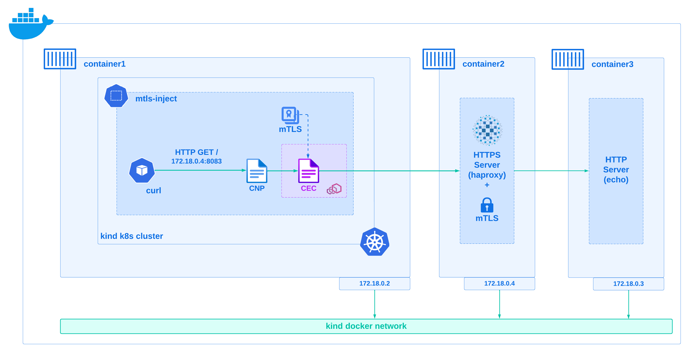
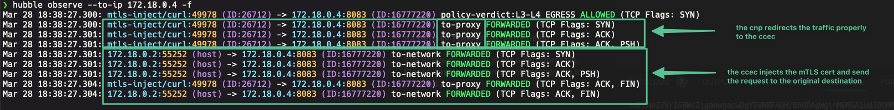

# Cilium Inject mTLS

## About This Lab

In this lab we are going to make use of a `Cilium Service Mesh` Envoy L7 advanced feature to redirect all traffic for a given destination to an `Envoy listener` where we will inject an `mTLS` (Mutual TLS) client certificate.

This is specially usefull when you want to communicate from your k8s cluster to a backend service that requires mTLS authentication, and you don't want to modify your application code to handle mTLS.

This scenario is also applicable when you want to use a third-party solution that offers some CRDs to interact with a custom backend, but this CRD doesn't support mTLS authentication natively. An example could be `Flux CD` `notification-controller` that provides a `Provider` CRD where you can define a generic webhook (see [here](https://fluxcd.io/flux/components/notification/providers/#generic-webhook)) to send notifications to a custom backend that you might want to build enforcing mTLS authentication, but this `Provider` CRD doesn't support mTLS natively to inject the client certificate to the requests.

> **Remark:** while this lab will give you step-by-step instructions to complete it successfully, it's recommended to have some knowledge of `Cilium Service Mesh` and `Envoy`. You can check this talk from the KubeCon EU 2024 where my coleague [@edgrz](https://github.com/edgrz) and I talk in depth about this Cilium feature that allows you to redirect specific traffic in your k8s cluster to an Envoy proxy to apply advanced L7 configurations: [Cilium + eBPF Day - KubeCon 2024 - Meshing It Up Securely](https://www.youtube.com/watch?v=kC8efabCH6s&list=PLj6h78yzYM2PHDqy_nINY8-462uYzb18d&index=10).

## Lab Environment

### Diagram



> **Note:** the IPs of the containers might vary depending on your environment.

## Pre-requisites

- [cfssl](https://formulae.brew.sh/formula/cfssl) installed.
- [jq](https://jqlang.github.io/jq/download/) installed.
- [make](https://opensource.com/article/18/8/what-how-makefile) installed.
- [Hubble CLI](https://docs.cilium.io/en/stable/gettingstarted/hubble_setup/#install-the-hubble-client) installed (Optional).
- [Curl](https://formulae.brew.sh/formula/curl) installed (Optional).

## Let's Get Started

### Clone This Repository

First, clone this repository.
  
```bash
git clone https://github.com/hmonsalv/cilium-inject-mtls.git
cd cilium-inject-mtls
```

### Install Kind Kubernetes Cluster

Then create a kind k8s cluster with Cilium CNI and Service Mesh features required for this lab, you will need to follow these instructions:

- Install [kind cluster](./kubernetes/kind/README.md).
- Install [Cilium](./kubernetes/cilium/README.md) in the kind cluster.

### Generate Certificates

In order to create all the certificates needed for this lab, you need to run the following make target (be sure to be on the root folder of this repository):

```bash
make all
```

This will create the  `./certs` folder and inside it will generate a self-signed CA (Root + Intermediate CA), a server certificate/key pair, and a client certificate/key pair issued by that CA that will be used for mTLS.

### Start the HTTPS Proxy Server (backend)

Now you can start the HTTPS proxy server `haproxy`:

```bash
docker-compose up -d
```

You can observe that it started 2 containers (as described in the diagram above):

- the `haproxy` container that listens on port `8083` and enforces mTLS authentication, redirecting all traffic to the `echo-server` container.
- and the `echo-server` container that listens on port `8081` acting as an echo HTTP server that responses with the request (and all its headers) that just arrived.

> **Note:** both containers use the `kind` docker network for the sake of simplicity, as we are going to reach `haproxy` later on in this lab from a `Cilium Envoy listener` running inside the `cilium` pod of the `kind` k8s cluster (which runs in the `kind` docker network as well).

### Test Connectivity to the HTTPS Proxy Server

#### Create a Curl Pod

From the root folder of this repository, export the kubeconfig file to interact with the kind k8s cluster:

```bash
export KUBECONFIG=./kubernetes/cilium-inject-mtls-demo.config
```

Let's create in the kind k8s cluster a `curl` pod in the `mtls-inject` namespace to perform some connectivity tests (notice that we are creating a secret with the client certificate and private key and mounting it in the pod's `/certs` folder):

```bash
kubectl create namespace mtls-inject
kubectl create --namespace mtls-inject secret tls tls-client-cert --key ./certs/client.key --cert ./certs/client.pem
cat<<EOF | kubectl apply -f -
apiVersion: v1
kind: Pod
metadata:
  name: curl
  namespace: mtls-inject
spec:
  containers:
    - name: curl
      image: curlimages/curl:latest
      command:
        - sleep
        - "3600"
      resources:
        requests:
          cpu: 10m
          memory: 10Mi
        limits:
          cpu: 200m
          memory: 256Mi
      volumeMounts:
        - name: certs
          readOnly: true
          mountPath: "/certs"
  volumes:
    - name: certs
      secret:
        secretName: tls-client-cert
EOF
```

The `curl` pod should be running and the client certificate mounted in the `/certs` folder:

```bash
❯ kubectl exec -it curl -n mtls-inject -- ls -lrt /certs
total 0
lrwxrwxrwx    1 root     root            14 Mar 28 17:49 tls.key -> ..data/tls.key
lrwxrwxrwx    1 root     root            14 Mar 28 17:49 tls.crt -> ..data/tls.crt
```

#### Get the IP of the HTTPS Proxy Server

If you remember, the `haproxy` container is running in the kind docker network, so this means that from the kind k8s clusters that also runs in such network, we can reach the `haproxy` container by its IP.

Let's get the IP of the `haproxy` container:

```bash
export HAPROXY_IP=$(docker inspect -f '{{range .NetworkSettings.Networks}}{{.IPAddress}}{{end}}' cilium-inject-mtls-example-haproxy-1)
echo $HAPROXY_IP
```

In my case, the IP of the `haproxy` container is `172.18.0.4`, but you might get a different one depending on your environment.

#### Curl to the HTTPS Proxy Server

Let's verify that the `haproxy` works as expected and when we specify a valid client cert issued by the CA, we get an echo response:

```bash
❯ kubectl exec -it curl -n mtls-inject -- curl --insecure --cert /certs/tls.crt https://$HAPROXY_IP:8083
{
    "args": {},
    "authorization": null,
    "full_path": "/?",
    "headers": {
        "Accept": "*/*",
        "Host": "172.18.0.4:8083",
        "User-Agent": "curl/8.7.1",
        "X-Forwarded-For": "172.18.0.2",
        "X-Forwarded-Proto": "https",
        "X-Ssl": "1",
        "X-Ssl-Client-Cn": "E40596F3-458E-4FAF-8A08-F539FD6B3575",
        "X-Ssl-Client-Dn": "/C=AU/ST=New South Wales/O=Panubo/CN=E40596F3-458E-4FAF-8A08-F539FD6B3575",
        "X-Ssl-Client-Notafter": "290327162700Z",
        "X-Ssl-Client-Notbefore": "240328162700Z",
        "X-Ssl-Client-Verify": "0",
        "X-Ssl-Issuer": "/C=AU/ST=New South Wales/O=Panubo/CN=Panubo Intermediate TEST 2022 G1"
    },
    "method": "GET",
    "path": ""
}
```

But when we don't specify the client certificate, we get an SSL error as expected:

```bash
❯ kubectl exec -it curl -n mtls-inject -- curl --insecure https://$HAPROXY_IP:8083
curl: (56) OpenSSL SSL_read: OpenSSL/3.1.4: error:0A00045C:SSL routines::tlsv13 alert certificate required, errno 0
command terminated with exit code 56
```

> **Note:** when curling to the `haproxy`, it serves in the TLS handshake a server certificate issued by the self-signed CA, which by default our system doesn't trust, so we need to either specify the `--cacert` option with the CA certificate or disable the SSL verification with the `--insecure` or `-k` option. In the example we used the latter for the sake of simplicity.

### Leveraging Cilium Service Mesh

Now we are going to leverage `Cilium Service Mesh` capabilities to redirect all traffic that goes to the `haproxy` container to an `Envoy listener` where we will inject the client mTLS client certificate.

For this purpose we will create the following Cilium CRs (custom resources):

- A `CiliumClusterwideEnvoyConfig` (`ccec`) that will define a Envoy listener (proxy) that injects the mTLS client certificate to all request that arrive, and send the request to the actual destination (the `haproxy` IP:port).
- A `CiliumNetworkPolicy` (`cnp`) that will redirect all traffic that goes to the `haproxy` container's IP:port to that Envoy listener.

#### Create Client Certificate Secret on cilium-secrets Namespace

Cilium Envoy Configs can only load by default certificates from the `cilium-secrets` namespace, so we need to create the client certificate secret in that namespace:

```bash
kubectl create --namespace cilium-secrets secret tls tls-client-cert --key ./certs/client.key --cert ./certs/client.pem
```

#### Create the CiliumNetworkPolicy

The following `cnp` redirects all egress traffic in `mtls-inject` namespace with destination `haproxy` IP:port to the envoy listener `mtls-injection-listener` defined in `mtls-injection-envoy` `cec`:

```bash
cat<<EOF | kubectl apply -f -
apiVersion: cilium.io/v2
kind: CiliumNetworkPolicy
metadata:
  name: mtls-injection-policy
  namespace: mtls-inject
spec:
  endpointSelector: {}
  egress:
    - toEndpoints:
        - matchLabels:
            io.kubernetes.pod.namespace: kube-system
            k8s-app: kube-dns
      toPorts:
        - ports:
            - port: "53"
              protocol: UDP
          rules:
            dns:
              - matchPattern: "*"
    - toEndpoints:
        - {}
    - toCIDR:
      - $HAPROXY_IP/32 
      toPorts:
      - ports:
        - port: '8083'
          protocol: TCP
        listener:
          envoyConfig:
            kind: CiliumClusterwideEnvoyConfig
            name: mtls-injection-envoy
          name: mtls-injection-listener
EOF
```

#### Create the CiliumClusterwideEnvoyConfig

The following `ccec` defines an Envoy listener `mtls-injection-listener` that will inject the mTLS client certificate `tls-client-cert` from the `cilium-secrets` namespace to all request that arrive and send that request to the `haproxy` IP:port:

```bash
cat<<EOF | kubectl apply -f -
apiVersion: cilium.io/v2
kind: CiliumClusterwideEnvoyConfig
metadata:
  name: mtls-injection-envoy
spec:
  resources:
  - "@type": type.googleapis.com/envoy.config.listener.v3.Listener
    name: mtls-injection-listener
    filter_chains:
    - filters:
      - name: envoy.filters.network.tcp_proxy
        typed_config:
          "@type": type.googleapis.com/envoy.extensions.filters.network.tcp_proxy.v3.TcpProxy
          stat_prefix: tls_stats
          cluster: "internal-tls-cluster"
  - "@type": type.googleapis.com/envoy.config.cluster.v3.Cluster
    name: "internal-tls-cluster"
    transport_socket:
      name: envoy.transport_sockets.tls
      typed_config:
        "@type": type.googleapis.com/envoy.extensions.transport_sockets.tls.v3.UpstreamTlsContext
        sni: $HAPROXY_IP
        common_tls_context:
          alpn_protocols:
          - http/1.1
          tls_certificate_sds_secret_configs:
          - name: cilium-secrets/tls-client-cert
          # validation_context_sds_secret_config: // removing, so that the server certificate is not validated
            # From: kubectl create secret generic public-cacert -n cilium-secrets --from-file=ca.crt=./certs/ca.crt
            #name: cilium-secrets/public-cacert
    connect_timeout: 55s
    type: STATIC
    load_assignment:
      cluster_name: internal-tls-cluster
      endpoints:
      - lb_endpoints:
        - endpoint:
            address:
              socket_address:
                address: $HAPROXY_IP
                port_value: 8083
EOF
```

> **Note:** pay attention to the `validation_context` of the `UpstreamTlsContext` is commented out, which means that Envoy proxy will not validate the server certificate. We have configured it like this because the `haproxy` server serves a self-signed certificate that our system doesn't trust by default. This is the same as using with curl the `--insecure` option. If we would want to validate the `haproxy` server's certificate, then we would need to create the `public-cacert` in `cilium-secrets` namespace from the `./certs/ca.crt` file and reference it in the `validation_context_sds_secret_config.name` field.

### Test Connectivity to the HTTPS Proxy Server via Cilium Envoy

If we now send an HTTP request from the `curl` pod to the `haproxy` container ***without specifying any client certificate***, we should get the same response as before, because now the mTLS client certificate is injected by the Envoy proxy:

```bash
❯ kubectl exec -it curl -n mtls-inject -- curl http://$HAPROXY_IP:8083
{
    "args": {},
    "authorization": null,
    "full_path": "/?",
    "headers": {
        "Accept": "*/*",
        "Host": "172.18.0.4:8083",
        "User-Agent": "curl/8.7.1",
        "X-Forwarded-For": "172.18.0.2",
        "X-Forwarded-Proto": "https",
        "X-Ssl": "1",
        "X-Ssl-Client-Cn": "E40596F3-458E-4FAF-8A08-F539FD6B3575",
        "X-Ssl-Client-Dn": "/C=AU/ST=New South Wales/O=Panubo/CN=E40596F3-458E-4FAF-8A08-F539FD6B3575",
        "X-Ssl-Client-Notafter": "290327162700Z",
        "X-Ssl-Client-Notbefore": "240328162700Z",
        "X-Ssl-Client-Verify": "0",
        "X-Ssl-Issuer": "/C=AU/ST=New South Wales/O=Panubo/CN=Panubo Intermediate TEST 2022 G1"
    },
    "method": "GET",
    "path": ""
}
```

> **Note:** pay attention to the curl command, now we are using `HTTP`, and not `HTTPS` in the URL. This is because now it's the Envoy proxy the one that will handle the `HTTPS` connection to the actual destination and keep the end-to-end encryption.

### Inspect the Traffic with Hubble

`Hubble` CLI connects to `hubble-relay` backend to inspect traffic, so in a new terminal we need to port-forward the `hubble-relay` service first:

```bash
kubectl port-forward -n kube-system svc/hubble-relay 4245:80
```

Open another terminal and run the following command to observe all egress traffic with destination to the `haproxy` container's IP:

```bash
hubble observe --to-ip $HAPROXY_IP -f
```

We can see with `Hubble` that the traffic from `mtls-inject/curl` pod with destination to the `haproxy` container's IP:port has been redirected to the envoy proxy (see `to-proxy` action), and from there the envoy proxy establishes another `TCP` connection to the `haproxy` and sends the `HTTPS` request:



### Clean Up the Lab Environment

To clean up the lab environment, you can run the following commands:

```bash
kind delete cluster --name cilium-inject-mtls-demo
docker-compose down
```

## Related Projects

This lab makes use of some resources from [panubo/mtls-example](https://github.com/panubo/mtls-example) GitHub repository, in particular:

- Makefile to generate all certificates.
- `haproxy` configuration.
- `echo-server` configuration.
